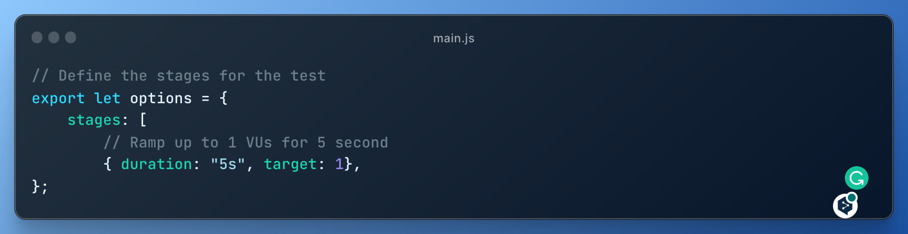
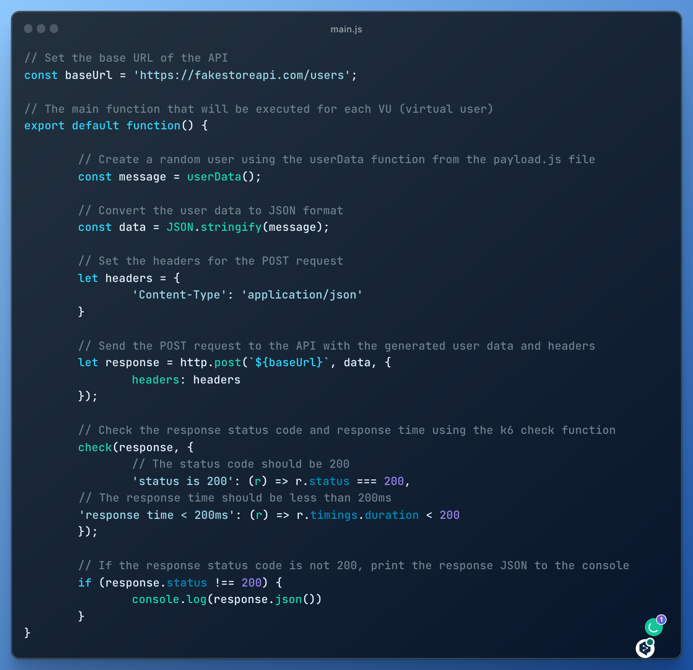
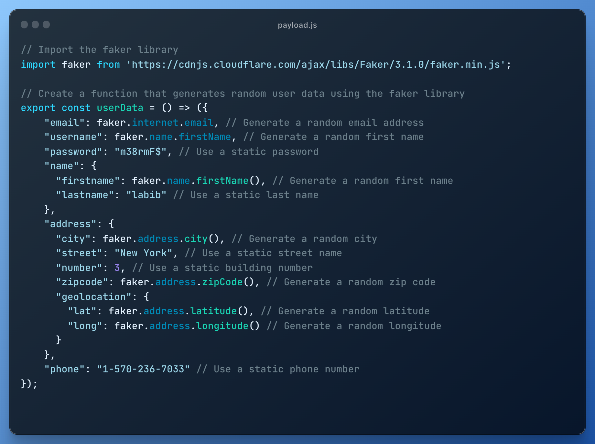

# k6-faker-load-testing

[](https://github.com/grafana/k6)

# k6-faker-load-testing

k6-faker is a small project that demonstrates how to use the Faker library with [k6](https://k6.io/), a modern load testing tool.

This project includes a simple k6 script that creates a fake user using Faker and posts it to the [FakeStoreAPI](https://fakestoreapi.com/) for testing purposes.

## Getting Started

To use this framework, you need to have Node.js and k6 installed on your machine.

- Clone the Repository

```bash
> git clone https://github.com/farhanlabib/k6-faker-load-testing.git
> cd k6-faker-load-testing
> npm install
```

- Install k6

```bash
https://k6.io/docs/get-started/installation/
```
## Folder Structure

Code is structured as shown below:

```
k6-Performance-Testing-Framework/
 ├── specs                                # The k6 test file is located in the spec folder.
 │    ├──main.js                          # Main k6 Script
 │    ├──test.js                          # Console Log File
 │
 ├── payload.js                           # Function for generate fake user data   
```
## Configuring the Test

The performance tests are configured using the options variable in the test script. The options variable defines the stages of the load test, including the duration and target number of requests per second for each stage.



The current configuration is set up as follows:

- Stage 1: 5 second duration and target of 1 requests per second

## Writing the Test



The main.js file contains the main function that will be executed for each virtual user. This function generates random user data using the userData function from the payload.js file, sends a POST request to the API with the generated data, and checks the response status code and response time using the k6 check function.


The payload.js file contains a function userData that generates a random user data object using the Faker.js library. The user data object contains properties such as email, username, password, name, address, and phone, with each property having randomly generated values using the Faker.js library.

## Run the Test

```bash
k6 run specs/main.js
```
This command will execute the test file and provide a summary of the test results in the console.

```bash
k6 run --log-format raw specs/main.js --console-output=./test.csv 
```
This command will execute the test file and provide a detailed raw log of the test results in a csv file.
## Conclusion

This is a basic example of how to use the the Faker.js library with the k6 load testing tool. You can customize the test to suit your needs by changing the options and the test function.

Feel free to fork and make pull request for any additional feature.

